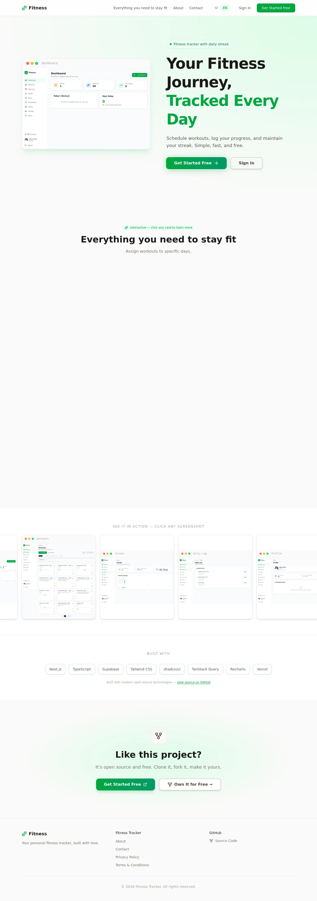
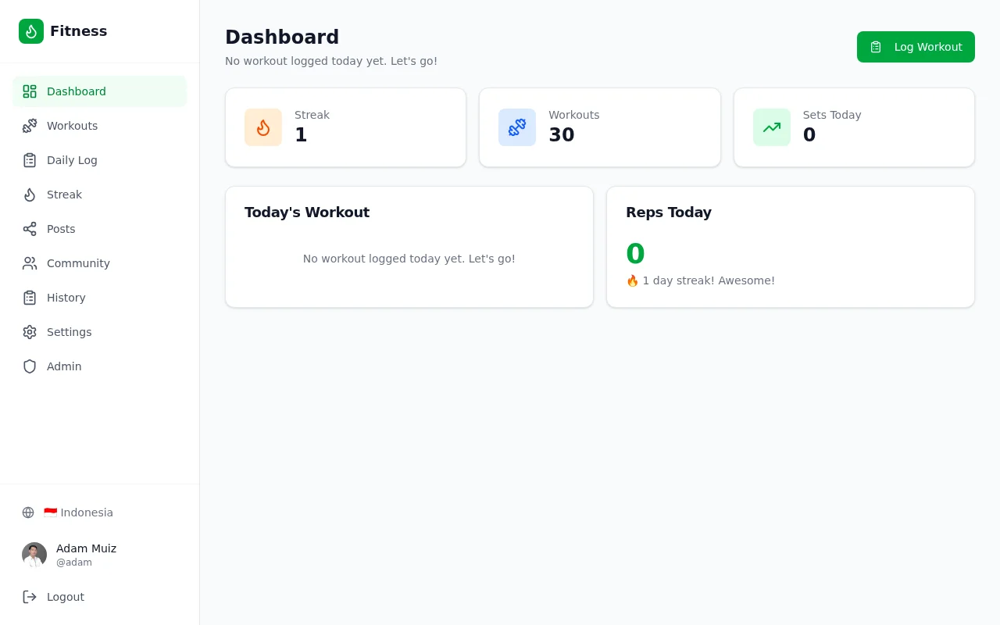
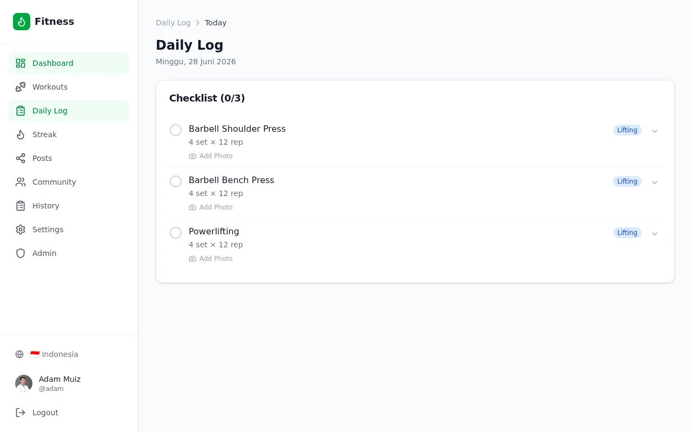
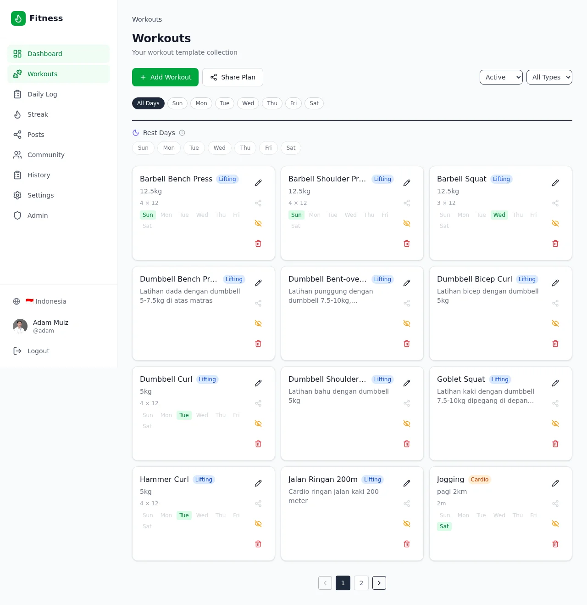
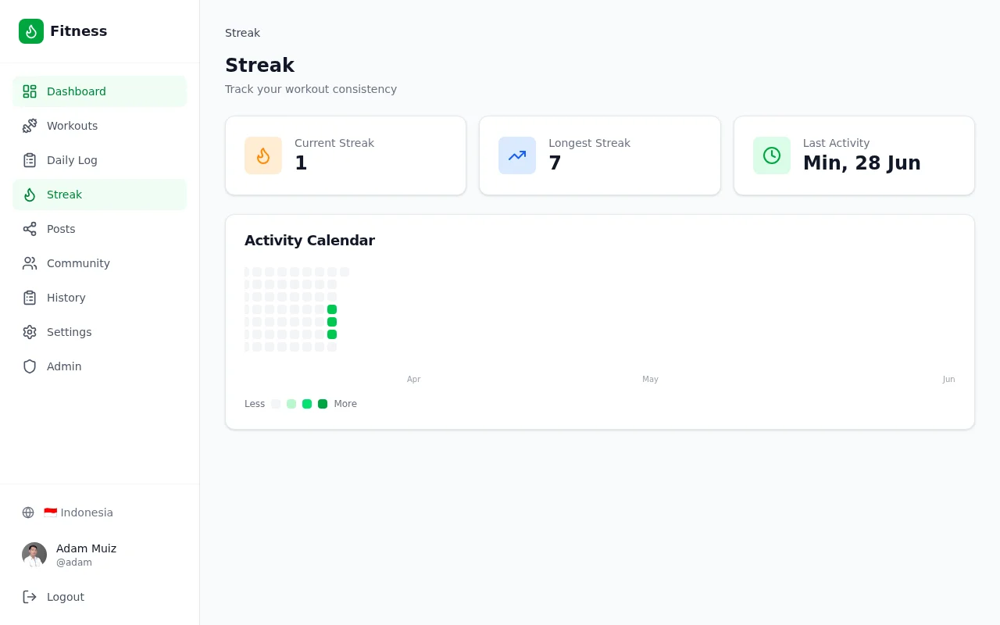

# Fitness Tracker

A full-stack fitness tracking application for planning weekly workouts, recording daily progress, maintaining streaks, and sharing activities with the community.

[Live Application](https://fitness.jyavani.com) | [Report an Issue](https://github.com/adammuizweb/fitness/issues)



## Features

- Lift and cardio workout templates with default sets, reps, distance, and duration.
- Weekly scheduling, rest days, and an editable daily checklist.
- **Other Workout** search for adding an active workout from a different day to today's checklist.
- Custom activities for exercise that is not part of the workout library.
- Workout history, progress photos, and a GitHub-style streak calendar.
- Separate Hide and Soft Delete behavior:
  - Hide removes a workout from the daily schedule while keeping it available.
  - Soft Delete moves a workout to Trash while preserving schedules and history.
- Public/private profiles, posts, follows, shared workouts, and shared plans.
- English and Indonesian interfaces.
- Responsive PWA for desktop and mobile use.
- Admin dashboard for users, statistics, and login security settings.
- Persistent login rate limiting by account and IP with configurable thresholds.

## Screenshots

| Dashboard | Daily Log |
| --- | --- |
|  |  |

| Workouts | Streak |
| --- | --- |
|  |  |

## Technology

- [Next.js](https://nextjs.org/) with the App Router
- [React](https://react.dev/) and TypeScript
- [Supabase](https://supabase.com/) for PostgreSQL, authentication, and Row Level Security
- [TanStack Query](https://tanstack.com/query) for client-side server state
- [Tailwind CSS](https://tailwindcss.com/) and reusable UI components
- [Serwist](https://serwist.pages.dev/) for PWA support
- [Vercel](https://vercel.com/) for application deployment
- External CDN storage for compressed workout photos

## Architecture

The application separates reusable workout definitions from daily activity records:

```text
workouts             Reusable lift/cardio templates
workout_schedules    Weekly schedule entries
workout_logs         Per-workout, per-day progress records
daily_streaks        Current and longest streak state
posts / follows      Community activity
shared_*             Shared workouts and weekly plans
security_settings    Admin-managed login security policy
login_rate_limits    Persistent account and IP counters
```

Checking or editing a workout on the Daily Log updates `workout_logs`; it does not create another workout template. A unique database constraint prevents duplicate logs for the same user, workout, and date.

## Security

- Supabase Auth validates credentials and provides its own authoritative rate limits.
- The application login endpoint adds configurable account and IP failure buckets.
- Rate-limit state is updated atomically in PostgreSQL and returns `429 Too Many Requests` with `Retry-After` when blocked.
- Admin-only settings and sensitive user changes are handled by server routes.
- Row Level Security prevents users from reading or modifying another user's private data.
- Users cannot modify their own role or ban status.
- Banned accounts are rejected by server guards, upload routes, and restrictive RLS policies.
- Security settings changes and administrative user changes are audited.

The public Supabase URL and anonymous key are designed for browser use. The service-role key and upload secret must remain server-only and must never use a `NEXT_PUBLIC_` prefix.

## Requirements

- Node.js 20 or newer
- npm
- A Supabase project, or the Supabase CLI for local development
- An upload endpoint compatible with the photo upload route if photo uploads are required

## Local Setup

1. Clone the repository.

   ```bash
   git clone https://github.com/adammuizweb/fitness.git
   cd fitness
   ```

2. Install dependencies.

   ```bash
   npm install
   ```

3. Create the local environment file.

   ```bash
   cp .env.example .env.local
   ```

4. Fill `.env.local` with credentials from your own services. Never commit this file.

5. Apply the database migrations in `supabase/migrations/` in numerical order. With a linked Supabase CLI project:

   ```bash
   npx supabase link --project-ref YOUR_PROJECT_REF
   npx supabase db push
   ```

6. Start the development server.

   ```bash
   npm run dev
   ```

7. Open [http://localhost:3000](http://localhost:3000).

## Environment Variables

| Variable | Visibility | Purpose |
| --- | --- | --- |
| `NEXT_PUBLIC_SUPABASE_URL` | Public | Supabase project URL |
| `NEXT_PUBLIC_SUPABASE_ANON_KEY` | Public | Supabase anonymous browser key |
| `SUPABASE_SERVICE_ROLE_KEY` | Server only | Privileged server operations and admin APIs |
| `UPLOAD_SECRET` | Server only | Authentication for the external photo upload endpoint |
| `NEXT_PUBLIC_APP_URL` | Public | Canonical application URL |
| `NEXT_PUBLIC_APP_NAME` | Public | Display name of the application |

Only placeholders belong in `.env.example`. Store production values in the deployment platform's encrypted environment settings.

## Database Migrations

Schema changes are tracked in `supabase/migrations/`. Apply database migrations before deploying application code that depends on new tables, columns, or RPC functions.

Important migration groups include:

- Core profiles, workouts, logs, and streaks
- Scheduling and rest days
- Photo arrays and upload accounting
- Community posts and follows
- Shared workouts and plans
- Custom Activity identification
- Workout soft deletion
- Login rate limiting and security hardening

## Commands

```bash
npm run dev      # Development server
npm run build    # Production build and TypeScript validation
npm run start    # Start a production build
npm run lint     # Run ESLint
```

## Deployment

The hosted application is deployed from the `main` branch to Vercel. A typical deployment sequence is:

1. Apply pending Supabase migrations.
2. Configure all environment variables in Vercel.
3. Push the application commit to `main`.
4. Wait for the Vercel deployment check to pass.
5. Smoke-test authentication, dashboard access, and affected API routes.

Do not commit `.env.local`, database passwords, service-role keys, access tokens, or upload secrets.

## Project Structure

```text
src/app/                 Next.js pages, layouts, and API routes
src/components/          UI and feature components
src/hooks/               TanStack Query hooks
src/lib/                 Authentication, Supabase, i18n, and utilities
src/types/               Shared TypeScript interfaces
public/                  PWA assets and screenshots
supabase/migrations/     Versioned PostgreSQL migrations
```

## License

This project is available under the [MIT License](LICENSE).
